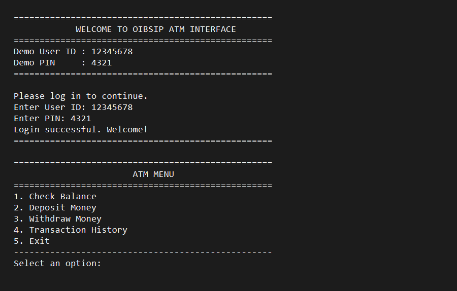
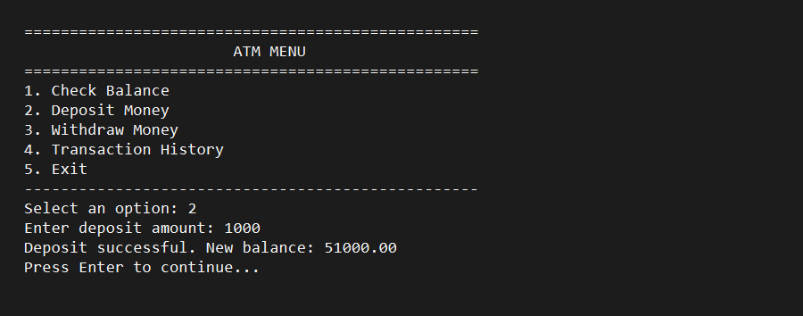
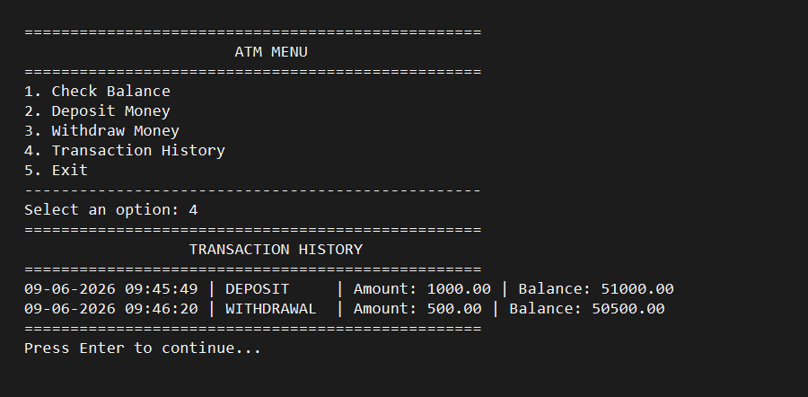

# ATMInterface

A beginner-friendly Core Java console-based ATM Interface project built for the Oasis Infobyte Java Development Virtual Internship. The application demonstrates Object-Oriented Programming, menu-driven console interaction, exception handling, and transaction tracking without using a database.

## Features

- User login system using User ID and PIN
- Check account balance
- Deposit money
- Withdraw money with insufficient balance protection
- Transaction history with timestamps
- Clean welcome, menu, and exit screens
- Input validation with exception handling

## Technologies Used

- Core Java
- Maven
- Scanner class
- ArrayList
- Object-Oriented Programming
- VS Code or IntelliJ IDEA

## Project Structure

```text
ATMInterface/
├── src/
│   └── main/
│       └── java/
│           └── com/
│               └── oibsip/
│                   └── atm/
│                       ├── App.java
│                       ├── ATM.java
│                       ├── Account.java
│                       ├── Transaction.java
│                       └── UserAuthentication.java
├── screenshots/
│   ├── welcome-screen.png
│   ├── menu-screen.png
│   ├── transaction-screen.png
│   └── exit-screen.png
├── target/
├── .gitignore
├── pom.xml
├── README.md
└── LICENSE
```

## How to Run

### Using VS Code or IntelliJ

1. Open the `ATMInterface` project folder in your IDE.
2. Make sure Java 17+ and Maven are installed.
3. Run `App.java`.

### Using Terminal

```bash
mvn clean compile
mvn exec:java
```

## Demo Login Credentials

- User ID: `12345678`
- PIN: `4321`

## Sample Output

```text
==================================================
            WELCOME TO OIBSIP ATM INTERFACE
==================================================
Demo User ID : 12345678
Demo PIN     : 4321
==================================================
Please log in to continue.
Enter User ID: 12345678
Enter PIN: 4321
Login successful. Welcome!
==================================================

==================================================
                       ATM MENU
==================================================
1. Check Balance
2. Deposit Money
3. Withdraw Money
4. Transaction History
5. Exit
--------------------------------------------------
Select an option: 1
--------------------------------------------------
Current Balance: 50000.00
--------------------------------------------------
```

## Screenshots

The screenshots below are included in the `screenshots/` folder.

### Welcome Screen



### Menu Screen



### Transaction Screen



### Exit Screen


## Author

- Name: Piyush Thakur
- Internship: Oasis Infobyte Java Development Virtual Internship
- Project: Core Java ATM Interface using OOP and Maven

## Notes

- The project uses a hardcoded demo account because no database is required.
- Transaction history is kept in memory during the session.
- Withdrawals are blocked when the account balance is insufficient.

## Repository

All internship tasks are maintained inside a single repository named `OIBSIP`.
