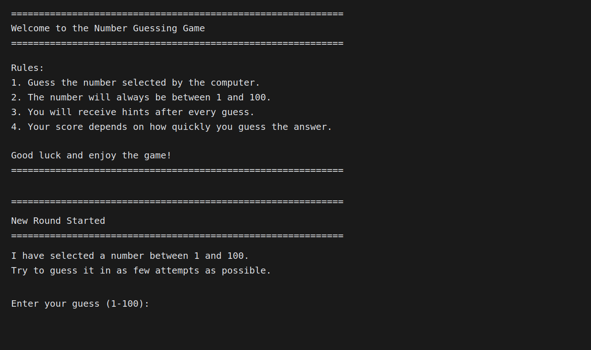
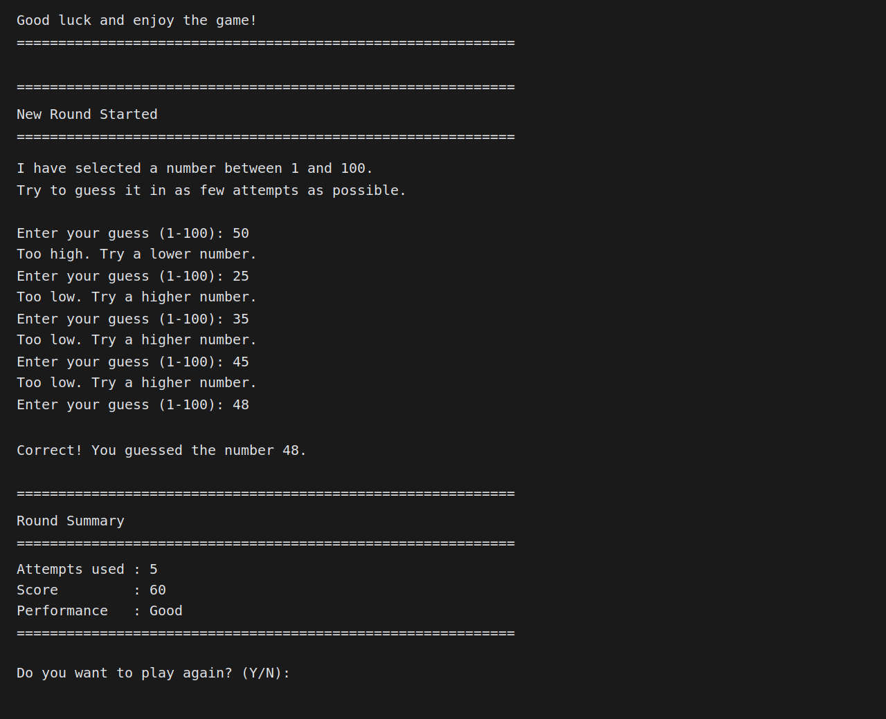
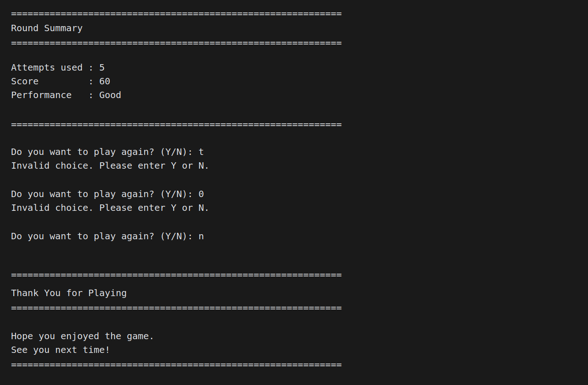

# NumberGuessingGame

A clean, beginner-friendly Core Java console project created for the Oasis Infobyte Java Development Virtual Internship.

## Features

- Random number generation between 1 and 100
- Console-based user interaction
- High / low feedback after every guess
- Attempt counting
- Score calculation based on attempts
- Multiple rounds with play-again option
- Input validation and exception handling
- Welcome screen and ending screen
- Clean OOP structure with separate methods

## Technologies Used

- Java 11+
- Core Java concepts
- Maven
- Console input using `Scanner`

## Project Structure

```text
NumberGuessingGame/
├── src/
│   └── main/
│       └── java/
│           └── com/oibsip/numberguessinggame/
│               ├── App.java
│               ├── GuessFeedback.java
│               └── NumberGuessingGame.java
├── screenshots/
├── .gitignore
├── pom.xml
└── README.md
```

## How to Run

### Using IntelliJ IDEA or VS Code

1. Open the project folder.
2. Make sure Java 11 or later is installed.
3. Import the Maven project.
4. Run `com.oibsip.numberguessinggame.App`.

### Using Terminal

```bash
mvn compile exec:java
```

If you want to build only:

```bash
mvn clean package
```

## Sample Output

```text
============================================================
Welcome to the Number Guessing Game
============================================================
Rules:
1. Guess the number selected by the computer.
2. The number will always be between 1 and 100.
3. You will receive hints after every guess.
4. Your score depends on how quickly you guess the answer.

Good luck and enjoy the game!
============================================================

============================================================
New Round Started
============================================================
I have selected a number between 1 and 100.
Try to guess it in as few attempts as possible.

Enter your guess (1-100): 50
Too low. Try a higher number.
Enter your guess (1-100): 75
Too high. Try a lower number.
Enter your guess (1-100): 63
Correct! You guessed the number 63.

============================================================
Round Summary
============================================================
Attempts used : 3
Score         : 80
Performance   : Excellent
============================================================
Do you want to play again? (Y/N): N

============================================================
Thank You for Playing
============================================================
Hope you enjoyed the game.
See you next time!
============================================================
```

## Screenshots

The project screenshots are stored in `screenshots/` and rendered below.

### Welcome Screen



### Gameplay



### Ending Screen



## Author

**Name:** Piyush Thakur<br>
**Program:** Oasis Infobyte Java Development Virtual Internship<br>
**Project:** Number Guessing Game<br>
**GitHub:** https://github.com/Piyushthakur99

## Repository

All internship tasks are maintained inside a single repository named `OIBSIP`.